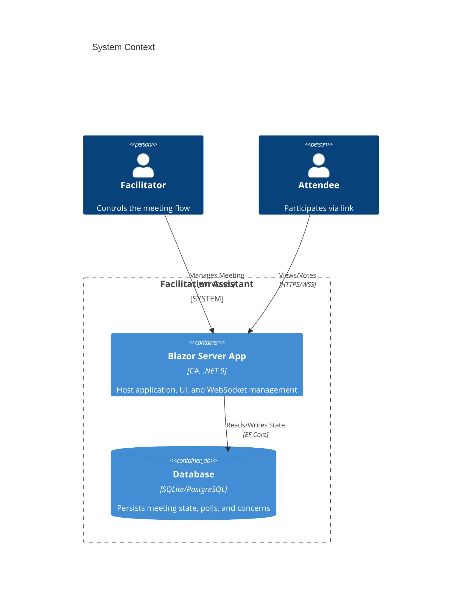

# Facilitation Assistant Architecture

## 1. Overview

**Style:** Monolithic, Blazor Server, Domain-Driven Design (Lite)
**Technology Stack:** .NET 9, Blazor Server, Entity Framework Core, SignalR, SQLite (Dev) / PostgreSQL (Prod)

The application is designed as a **self-contained monolith**. Simplicity and development speed are prioritized over distributed scale. The core complexity lies in **state synchronization** between the facilitator and attendees, which is handled via SignalR and server-side state management.

## 2. Architecture Diagram (C4 Container)



## 3. Project Structure

We will adhere to a **Clean Architecture** approach, simplified for a single hosting process.

```text
/src
  /FacilitationAssistant.Core         <-- Domain Layer (Start here)
     /Domain
       /Aggregates
         /Meeting
           Meeting.cs (Aggregate Root)
           Stage.cs
           Poll.cs
           Concern.cs
       /ValueObjects
         MeetingId.cs
         AccessCode.cs
     /Interfaces
       IMeetingRepository.cs
       ICurrentUserService.cs
     /Services
         (Domain Services if complex logic exists)

  /FacilitationAssistant.Infrastructure  <-- Data Access
     /Persistence
       AppDbContext.cs
       /Configurations (EF Fluent Config)
     /Services
       SystemClock.cs

  /FacilitationAssistant.Web          <-- UI & Application Layer
     /Common
       /MediatR
         /Commands (CreateMeeting, StartStage, Vote)
         /Queries (GetMeetingState)
     /Components
       /Meeting
         TimerDisplay.razor
         AgendaList.razor
     /Pages
       Extensions.razor (Facilitator View)
       Join.razor (Attendee View)
     /Hubs
       MeetingHub.cs (SignalR)
```

## 4. Key Design Decisions

### 4.1. Persistence & State Management
*   **Source of Truth:** The Database is the ultimate source of truth.
*   **DbContext Scoping (CRITICAL):** Because Blazor Server circuits are long-lived, we **cannot** inject a Scoped `DbContext` directly into components or long-living services.
    *   We will use `IDbContextFactory<AppDbContext>` to create short-lived Contexts for each Command/Query Unit of Work.
    *   MediatR handlers will wrap their logic in `using var context = _factory.CreateDbContext();`.
*   **State Propagation:** We will use **MediatR** for all state-changing actions.
    1.  User Action (UI) -> Sends Command (MediatR).
    2.  Handler loads Aggregate from DB (using short-lived context) -> Modifies Domain Entity -> Saves to DB.
    3.  Handler publishes `MeetingUpdatedNotification`.
    4.  `MeetingHub` subscribes to notification -> Pushes updated state DTO to all connected clients via SignalR.
*   **Why?** This prevents concurrency exceptions typical in Blazor Server when multiple components share the same Scoped Context on the same circuit.

### 4.2. Authentication (No-Auth)
*   **Facilitator:** Identified by a unique `Guid` (FacilitatorKey) generated at meeting creation. This key is stored in the URL (or LocalStorage if we want persistence across closing tabs).
*   **Attendee:** Identified by the public `MeetingId`.
*   **Identity:** `ICurrentUserService` will resolve the user type based on the URL/Session context.

### 4.3. Real-Time (SignalR)
*   **Group Management:** SignalR Groups will be used per meeting. `Groups.AddToGroupAsync(Context.ConnectionId, meetingId)`.
*   **Public State (Push):** The Public Meeting State (Current Stage, Timer, Public Chat, Poll Results) is pushed to *all* clients via SignalR whenever it changes.
    *   *Timer Strategy:* Send `StageStartedAt` (UTC timestamp). Clients calculate "Time Remaining" locally. *Never stream countdown seconds.*
*   **Private Data (Pull):** Private Notes are **NOT** included in the public SignalR payload to prevent data leaks.
    *   *Mechanism:* Clients fetch their private notes via a separate MediatR Query (`GetMyNotesQuery`) on initialization or when they receive a generic `NotesUpdated` notification.

## 5. Core Interfaces (Draft)

### 5.1. The Meeting Aggregate
This is the heart of the system.

```csharp
public class Meeting : AggregateRoot
{
    public Guid Id { get; private set; }
    public string Title { get; private set; }
    public Guid FacilitatorKey { get; private set; } // The "Password" for admin rights
    
    private readonly List<AgendaStage> _stages = new();
    public IReadOnlyCollection<AgendaStage> Stages => _stages.AsReadOnly();

    private readonly List<Attendee> _attendees = new();
    public IReadOnlyCollection<Attendee> Attendees => _attendees.AsReadOnly();

    private readonly List<Message> _messages = new();
    public IReadOnlyCollection<Message> Messages => _messages.AsReadOnly();
    
    public MeetingState State { get; private set; } // NotStarted, InProgress, Completed

    // Domain Behaviors
    public void StartStage(Guid stageId, IDateTimeProvider clock) { ... }
    public void CompleteCurrentStage(IDateTimeProvider clock) { ... }
    public void AddPoll(Poll poll) { ... }
    public void RegenerateFacilitatorKey() => FacilitatorKey = Guid.NewGuid();
}

public class Attendee
{
    public string SessionId { get; private set; } 
    public string DisplayName { get; private set; }
    public DateTime JoinTime { get; private set; }
}

public class Note
{
    public Guid Id { get; private set; }    
    public string Content { get; private set; }
    public bool IsPrivate { get; private set; }
    public string OwnerSessionId { get; private set; } // Only owner sees this if private
    public Guid? LinkedStageId { get; private set; }
}
Guid Id { get; private set; } // Critical for client-side "New Message" tracking
    public string Content { get; private set; }
    public DateTime Timestamp { get; private set; }
    public MessageType Type { get; private set; } // Announcement, Question
    public bool IsClosed { get; private set; } // For "Close Message" feature
    public string Content { get; private set; }
    public DateTime Timestamp { get; private set; }
    public MessageType Type { get; private set; } // Announcement, Question
    public string SenderName { get; private set; }
}
```

### 5.2. Query/Command Separation
Use `record` types for simple messages.

```csharp
// Command
public record StartStageCommand(Guid MeetingId, Guid StageId) : IRequest<Result>;

// Notification
public record MeetingStateChangedNotification(Guid MeetingId) : INotification;
```

## 6. Technical Risks & Mitigations

### 6.1. Performance (N+1 Queries)
*   **Risk:** Loading a meeting with 50 stages and 200 votes might be slow.
*   **Architecture Mitigation:** usage of `Include()` or Split Queries (`AsSplitQuery()`) in EF Core when loading the Meeting Aggregate.
*   **Optimization:** Create a flat `MeetingViewModel` optimized for the read-side (projected directly in the SQL query).

### 6.2. Connection Drops
*   **Risk:** SignalR disconnects mobile users.
*   **Architecture Mitigation:** The "Client" (Blazor Component) must handle the `HubConnection.Closed` event and implement an automatic retry policy. The UI must show a "Reconnecting..." banner.

## 7. Data Flow Example: "Next Stage"

1.  **Facilitator Component:** Click "Next Stage" button.
2.  **Blazor Code-Behind:** `mediator.Send(new NextStageCommand(meetingId))`
3.  **CommandHandler:**
    *   Fetch `Meeting` from DB.
    *   Call `meeting.MoveToNextStage(DateTime.UtcNow)`.
    *   `dbContext.SaveChanges()`.
    *   `mediator.Publish(new MeetingUpdatedEvent(meetingId))`.
4.  **NotificationHandler:**
    *   Injects `IHubContext<MeetingHub>`.
    *   Fetches fresh `MeetingStateDTO`.
    *   `hub.Clients.Group(meetingId).SendAsync("ReceiveState", dto)`.
5.  **Attendee Component:**
    *   `MeetingHub.On("ReceiveState", dto => ...)`
    *   Updates local model -> `StateHasChanged()`.

## 8. Definition of Done (Architecture)

*   [ ] Solution created with 3 projects (Core, Infra, Web).
*   [ ] EF Core configured with SQLite.
*   [ ] Basic "Create Meeting" flow working end-to-end.
*   [ ] SignalR Hub responding to "JoinMeeting".
